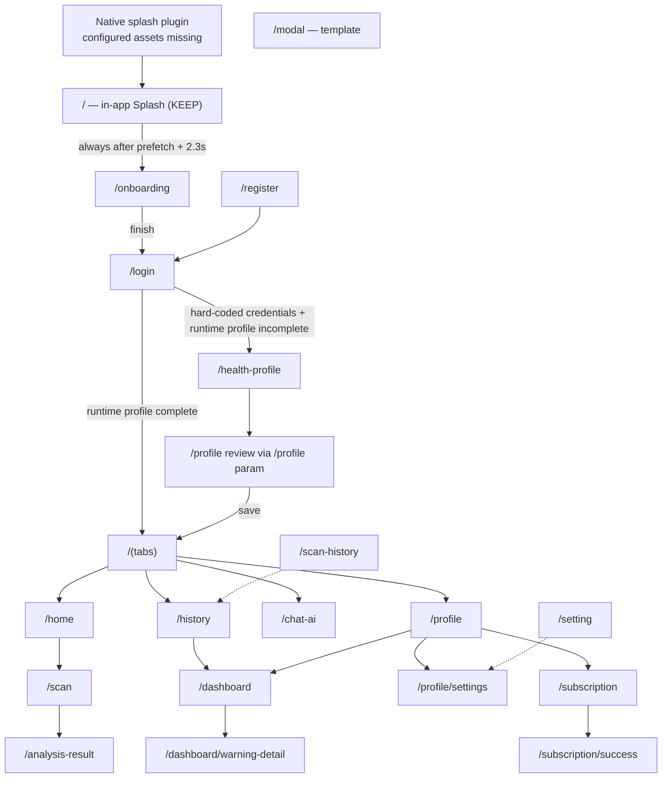
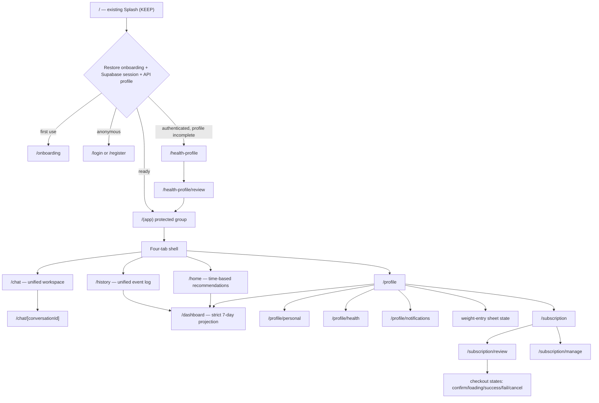

# Route and Navigation Audit

## Routing baseline

Expo Router is active through `main: expo-router/entry`, the `expo-router` app-config plugin, and `src/app`. Typed routes and the React Compiler are enabled. The root layout is a `Stack`; `(tabs)` is a nested JavaScript `Tabs` navigator with a custom bottom bar. The repository follows the SDK 54 file-routing model, but it does not define `+not-found.tsx`, route-level error boundaries, protected route groups, or persisted boot guards. Relevant SDK 54 references: [Expo Router](https://docs.expo.dev/versions/v54.0.0/sdk/router/) and [SplashScreen](https://docs.expo.dev/versions/v54.0.0/sdk/splash-screen/).

`app.json` declares the `nutelytfe` URL scheme. No explicit deep-link mapping, incoming-link normalization, or guard is present. A deep link can therefore enter UI routes without authentication or profile-completion checks.

## Current route inventory

All access conditions below describe current behavior, not the proposed policy. Except for Splash, every UI status defaults to replacement in the upcoming refactor.

| Route path | File | Parent / type | Current access conditions | Owner / rendered screen | Important dependencies | Status |
|---|---|---|---|---|---|---|
| `/` | `src/app/index.tsx` | Root Stack index | Always; initial route anchored by root layout | onboarding / `SplashScreen` | Expo Asset/Image, timer, onboarding assets | **KEEP** |
| `/onboarding` | `src/app/onboarding.tsx` | Root Stack screen | No guard; Splash always redirects here | onboarding / `OnboardingFlowScreen` | local step state, auth asset prefetch | REPLACE UI |
| `/login` | `src/app/login.tsx` | Root Stack screen | No anonymous-only guard | auth / `LoginScreen` | hard-coded credentials, Profile Context | REPLACE UI |
| `/register` | `src/app/register.tsx` | Root Stack screen | No anonymous-only guard | auth / `RegisterScreen` | local UI only; submit is a no-op | REPLACE UI |
| `/home` | `src/app/(tabs)/home.tsx` | `(tabs)` initial tab | No auth/profile guard | home / `HomeScreen` | Profile Context, Home query | REPLACE UI |
| `/history` | `src/app/(tabs)/history.tsx` | `(tabs)` tab | No guard | history / `HistoryScreen` | Profile Context, History query | REPLACE UI |
| `/chat-ai` | `src/app/(tabs)/chat-ai.tsx` | `(tabs)` tab | No guard | ai-chat / `ChatAIScreen` | Recipes query, local conversation state | ROUTE CHANGE REQUIRED; REPLACE UI |
| `/profile` | `src/app/(tabs)/profile.tsx` | `(tabs)` tab | No guard | profile / `ProfileScreen` | Profile Context, health-profile utilities | REPLACE UI |
| `/profile/settings` | `src/app/profile/settings.tsx` | Root Stack screen | No guard | profile / `ProfileSettingsScreen` | route-param profile, local toggles | ROUTE CHANGE REQUIRED; REPLACE UI |
| `/setting` | `src/app/setting.tsx` | Root Stack redirect | Always redirects | legacy -> `/profile/settings` | routes config | REMOVE LATER |
| `/health-profile` | `src/app/health-profile/index.tsx` | Root Stack branch | No auth/edit-policy guard | health-profile / four-step `HealthProfileFlowScreen` | local form state | REPLACE UI |
| `/health-profile/review` | `src/app/health-profile/review.tsx` | Root Stack branch | No guard | profile / `ProfileScreen mode="review"` | JSON route param | ROUTE CHANGE REQUIRED; REPLACE UI |
| `/health-profile/complete` | `src/app/health-profile/complete.tsx` | Root Stack branch | No guard | temporary route-local component | direct router calls | REMOVE LATER |
| `/health-profile-summary` | `src/app/health-profile-summary.tsx` | Root Stack screen | No guard | profile / `HealthProfileSummaryScreen` | JSON route param | ROUTE CHANGE REQUIRED; REPLACE UI |
| `/dashboard` | `src/app/dashboard/index.tsx` | Root Stack branch | No guard | dashboard / `DashboardScreen` | Dashboard query, route-param profile | REPLACE UI |
| `/dashboard/warning-detail` | `src/app/dashboard/warning-detail.tsx` | Root Stack branch | No guard | dashboard / `DashboardWarningDetailScreen` | Dashboard query, route-param profile | UNKNOWN / REMOVE OR REMAP LATER |
| `/subscription` | `src/app/subscription/index.tsx` | Nested Subscription Stack | No guard / entitlement policy | subscription / `SubscriptionScreen` | plans query, local selected plan | REPLACE UI |
| `/subscription/success` | `src/app/subscription/success.tsx` | Nested Subscription Stack | Directly addressable; no payment proof | subscription / `SubscriptionSuccessScreen` | plan query, device date | ROUTE CHANGE REQUIRED; REPLACE UI |
| `/scan` | `src/app/scan/index.tsx` | Root Stack branch | No guard; requests camera permission | food-analysis / `ScanCameraScreen` | `expo-camera`, route-param profile | REMOVE LATER (Production-deferred) |
| `/analysis-result` | `src/app/analysis-result/index.tsx` | Root Stack branch | No guard | food-analysis / `AnalysisResultScreen` | food query, profile-based local rules | REMOVE LATER (Production-deferred) |
| `/scan-history` | `src/app/scan-history/index.tsx` | Root Stack redirect | Always redirects | legacy -> `/history` | route params | REMOVE LATER |
| `/modal` | `src/app/modal.tsx` | Root Stack modal presentation | No guard | modal / Expo-template `ModalScreen` | template theme utilities | REMOVE LATER |

The root `Stack` explicitly registers only part of the file tree. Expo Router still discovers the unlisted files. This is legal, but the mixture of explicit registration, per-route `Stack.Screen` mutations, and implicit screens makes route policy hard to review.

## Layouts and navigation behavior

### Root layout

`src/app/_layout.tsx` performs global composition:

- imports NativeWind global CSS and Reanimated;
- adapts `expo-image` to NativeWind;
- selects React Navigation light/dark themes;
- mounts `QueryProvider` and `MainProfileProvider`;
- creates the root Stack and web-sized application frame;
- anchors the stack at `index`.

It does not restore authentication, load fonts, call `SplashScreen.preventAutoHideAsync()` / `hideAsync()`, wait for persisted onboarding, or gate protected routes.

### Tabs layout

`src/app/(tabs)/_layout.tsx` defines four tabs: Home, History, Chat AI, and Profile. It uses `backBehavior="none"`, lazy screens, no headers, and a custom absolute `BottomTabBar`. The target Figma uses the same four conceptual destinations but labels Chat as “Trò chuyện,” so the proposed route contract uses `chat` rather than retaining the implementation-specific `chat-ai` name.

### Subscription layout

`src/app/subscription/_layout.tsx` is a headerless nested Stack with index and success screens. Figma requires a larger state machine: plan selection, selected-plan tray, review, policy agreement, confirmation dialog, processing, success, failure, cancellation, management, and management loading.

## Guard audit

| Guard / restoration | Current location | Finding |
|---|---|---|
| Native boot splash | `app.json` plugin | Configured, but all referenced icon/splash files are missing. |
| In-app Splash | `/` -> `features/onboarding/screens/splash-screen.tsx` | Prefetches assets, enforces 2.3 seconds, then always replaces with `/onboarding`. |
| Onboarding completion | None | Not persisted; every cold start returns to onboarding. |
| Supabase session restoration | None | Absent. |
| Backend JWT restoration / refresh | HTTP stubs only | Token reader returns `null`; refresh always rejects. |
| Anonymous-only auth guard | None | Authenticated state does not exist. |
| Authenticated app guard | None | `/home`, `/dashboard`, etc. are directly accessible. |
| Health-profile completion guard | `LoginScreen` only | A runtime Context boolean chooses `/home` vs `/health-profile` after matching one hard-coded account. Deep links bypass it; reload clears it. |
| Profile-edit policy guard | None | No 15-day/30-day limit or backend policy exists. |
| Subscription entitlement guard | None | Success/management states are not proven. |
| Not-found route | None | `+not-found.tsx` is missing. |

## Exact Splash / boot flow to preserve

1. Native config: `app.json` -> `plugins[expo-splash-screen]`, white/light and black/dark backgrounds, 200px contain image.
2. Native assets: configured `assets/images/splash-icon.png` plus app icons/favicons. These files do not exist and must be supplied before release.
3. JavaScript entry: `package.json` -> `expo-router/entry`.
4. Initial route: `src/app/index.tsx` -> `features/onboarding/screens/splash-screen.tsx`.
5. App Splash work: loads the logo/onboarding images, prefetches image URIs, animates the ring, and holds for at least 2,300ms.
6. First redirect: unconditional `router.replace('/onboarding')`.
7. Fonts: no custom font loading is currently part of boot despite `expo-font` being installed.
8. Auth restoration: none.

**KEEP means preserving steps 3–6 and the visual/behavioral Splash screen.** Phase 1 must repair missing native assets and insert session/onboarding restoration around the first redirect without redesigning the Splash UI.

## Current navigation diagram

## Proposed target navigation based on Figma

This is a route contract proposal, not an implementation. Transient sheets, dialogs, loading, empty, and error variants remain states of their owning route rather than separate routes.

### Proposed access policy

- Public: `/`, `/onboarding`, `/login`, `/register`, password recovery callback routes.
- Authenticated but profile-incomplete: health-profile wizard and logout only.
- Protected: tabs, Dashboard, profile editing, conversation, History, and subscription preview.
- Entitlement-aware: Premium-only post-MVP functionality; the MVP plan/checkout experience remains mock UI.
- Deep links must pass through the same restored boot state, not rely on screen-level redirects.

## Navigation mismatches with Figma

- Figma Chat is a single unified workspace with new-conversation and history-drawer affordances; current Chat first asks users to choose split modes.
- Figma Health Profile has four explicit steps including target weight, pacing, review, and multi-select diets/allergies; current route pushes a Profile screen for review and lacks target weight.
- Figma Profile contains dedicated personal-info, health-edit, goal-confirm, quick-weight, notifications, logout, loading, and error states; current code compresses most of these into two screens and local no-op rows.
- Figma Premium requires review/payment/management states; current success route is directly addressable and has no payment-state contract.
- Figma History filter UI is a bottom sheet state, not a route.
- Figma Dashboard has seven states on one strict seven-day route. The current separate warning-detail route has no direct target frame and requires product review.

## Route files likely impacted in Phase 1

Preserve `src/app/index.tsx` and the current Splash screen ownership. Expected impact elsewhere:

- `src/app/_layout.tsx`: boot state, providers, protected/public grouping, native splash coordination.
- `src/app/(tabs)/_layout.tsx` and four tab routes: target naming and replacement screens.
- Auth/onboarding/health-profile route files: guarded public/setup flows.
- Profile route subtree: personal, health, notification, and transient sheet/dialog ownership.
- Chat route subtree: unified workspace and optional dynamic conversation route.
- Subscription route subtree: review, mock checkout outcomes, and management.
- Legacy/template/deferred routes: retire only after replacement parity and explicit approval.
- Add a `+not-found.tsx` route and route-level error boundaries as part of navigation hardening.
