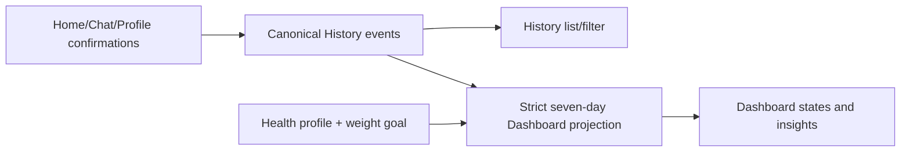

# Risks, Decisions, and Migration Plan

## Risk register

| ID | Severity | Risk | Evidence | Impact / mitigation gate |
|---|---|---|---|---|
| R-01 | Critical | Auth/session architecture absent | hard-coded login; Supabase absent; JWT/refresh stubs | Do not ship protected UI until token exchange, restoration, guards, refresh, and logout are tested. |
| R-02 | Critical | Dashboard is disconnected from History/Profile | separate static fixtures and contracts | Approve one confirmed event source and seven-day projection before either screen migration. |
| R-03 | Critical | Mock initial data can suppress REST requests | all hooks seed fixtures; `refetchOnMount: false` | Correct data-source selection before backend integration or query-state UI. |
| R-04 | Critical | Missing app icon/splash assets | all six `app.json` image paths absent | Provide canonical assets and validate native config while preserving Splash UI. |
| R-05 | High | Health PII serialized in route params | Profile/Health/Dashboard/food-analysis pass JSON | Replace with session/query state and stable IDs before deep-link hardening. |
| R-06 | High | Missing canonical domain contracts | event, conversation, activity, weight, alert, status/payment models absent | Contract approval is a prerequisite for feature UI work. |
| R-07 | High | Large screen components combine behavior and presentation | Chat 1,109 lines; Dashboard 776; Profile 641; Subscription 509 | Extract feature view models/components around approved contracts, not by visual-only slicing. |
| R-08 | High | Business/medical logic in frontend | food thresholds; BMI labels; Chat recognizers; goal options | Move backend-owned nutrition/alert rules out of UI; get product/clinical approval for retained utilities. |
| R-09 | High | No auth/onboarding/profile persistence | runtime Context/local state | Boot and deep links cannot determine correct route; solve in first infrastructure slice. |
| R-10 | High | Figma state coverage exceeds current query behavior | 50 frames including many loading/error/empty states | Build reusable query-state patterns and test fixture states. |
| R-11 | Medium | Raw style/token fragmentation | widespread hex/RGBA/inline style; duplicate token maps | Approve semantic Figma tokens before replacement screens. |
| R-12 | Medium | Product scope conflicts in current options | health goals include maintain/muscle/gain | Remove from new weight-loss MVP flow only after product sign-off; do not mutate Phase 0 code. |
| R-13 | Medium | Camera/voice scope creep | active scan routes, Figma controls, fake Chat voice | Keep Production-deferred and out of MVP migration acceptance criteria. |
| R-14 | Medium | Premium UI may imply real entitlement/payment | directly addressable success; many Figma payment states | Label as simulated UI; no entitlement decisions from local route state. |
| R-15 | Medium | No test suite | no test script/files | Add contract/unit/navigation tests before retiring old UI. |
| R-16 | Medium | Missing not-found/error boundaries | no `+not-found`, route errors | Add navigation safety after route contract approval. |
| R-17 | Low-medium | Expo patch/version drift | Expo check expects `~54.0.36` | Upgrade only in an isolated approved dependency task with type/lint/doctor/build verification. |
| R-18 | Low-medium | Normal lint cache failure | Expo lint cannot write `.expo/cache`; uncached ESLint passes | Use no-cache in CI/audit or repair permissions outside UI refactor scope. |

## Open decisions

| ID | Decision | Options / recommendation | Owner / deadline |
|---|---|---|---|
| D-01 | Health-profile edit cadence | No limit, 15 days, 30 days, or confirmation-only. **Recommendation:** backend-controlled policy returned with `canEdit/nextEditableAt/reason`; no client hard-code. | Product + backend before Profile Health slice |
| D-02 | Auth token boundary | Exact Supabase -> ASP.NET exchange endpoint, access/refresh storage, rotation, revoke, and failure behavior. | Backend + security before protected routes |
| D-03 | Onboarding completion ownership | Local persisted flag vs backend profile state. **Recommendation:** local first-run flag plus server profile-completion authority after sign-in. | Product + architecture before boot work |
| D-04 | Meal-window interval semantics | Define inclusive/exclusive edges and timezone. **Recommendation:** `[start,end)` in user profile timezone with device fallback and server-provided current context where available. | Product + backend before Home |
| D-05 | Outside-window recommendations | Light snack, exercise, or a ranked mix; determine nutrition priority and contraindications. | Product/nutrition before Home |
| D-06 | History retention and union membership | Confirm meals, saved recipes, consumed foods, activities, weight, conversations; decide if viewed-only events remain. | Product + backend before History |
| D-07 | Dashboard source/thresholds | Server read model vs frontend derivation; completeness and alert rules. **Recommendation:** backend returns strict seven-day projection with source metadata. | Backend + product before Dashboard |
| D-08 | Conversation route/persistence | `/chat/[id]`, title generation, retention, pagination, deletion. **Recommendation:** route-addressable persisted conversations; REST for MVP. | Product + backend before Chat |
| D-09 | Structured AI response contract | Supported content/action blocks and confirmation workflow. | Backend AI + frontend before Chat |
| D-10 | Nutrition/recipe versioning | Define basic vs AI-adjusted version, provenance, changes, warnings, and save identity. | Nutrition/AI before Chat recipe cards |
| D-11 | Premium demo depth | Plan preview only vs simulated checkout/management outcomes. **Recommendation:** implement only frames necessary for demo script and label simulation. | Product before Subscription |
| D-12 | Notification scope | Settings UI only vs real local scheduling/backend reminders; permission timing. | Product before Notifications |
| D-13 | Weight measurement behavior | Units, same-day duplicates, edit/delete, source, Dashboard refresh. | Product + backend before quick weight |
| D-14 | Media contract | Storage key/URL, transformations, cache, alt text; local fixture adapter. | Backend + design before card migration |
| D-15 | Old warning-detail route | Retain as Dashboard detail, replace with in-page state, or remove. No direct target Figma frame exists. | Product/design before Dashboard routing |

## Premium capability classification

| Capability | Classification | Notes |
|---|---|---|
| Plan list/comparison and Premium preview | MVP UI placeholder | Safe for demo with clear disclosure. |
| Simulated select/review/success/failure/cancel | MVP only if required by demo script | No real purchase or entitlement. |
| Basic AI limit display | Unknown | Needs actual MVP limit policy. |
| Advanced nutrition analysis | Post-MVP entitlement | Backend capability not present. |
| Advanced personalized recipes | Post-MVP | Do not promise in current MVP behavior. |
| Long-term tracking beyond seven-day Dashboard | Post-MVP | Dashboard MVP remains strict seven days. |
| Personalized wake/sleep meal windows | **Post-MVP confirmed** | Never hard-code into MVP. |
| Real app-store billing/restore/manage | Post-MVP/unknown | Current/Figma remains UI mock until explicitly scoped. |

## Architectural targets

### Home recommendation target

`HomeScreen -> useHomeRecommendations(context) -> recommendation API/repository -> backend time/nutrition engine`

Supporting frontend pieces:

- immutable meal-window configuration fallback;
- pure meal-period resolver accepting timestamp + timezone + config;
- one local-time adapter, not `new Date()` in screens;
- recommendation DTO with numeric nutrition and explicit actions;
- confirm-meal mutation that appends a History event and invalidates Home/History/Dashboard;
- no diet/medical filter logic inside Home UI.

### Unified Chat Workspace target

- One tab entry, not separate cooking/eating-out navigation modes.
- New conversation, persisted list/search drawer, route-addressable conversation.
- Time-aware quick prompts from configuration/API.
- Message content discriminated union: text, quick prompt, recipe card/version, food feedback, activity suggestion, warning/transparency note, confirmation/action result.
- REST request state for MVP: optimistic user message, pending assistant placeholder, retryable failed response.
- Save recipe and confirm consumed meal/activity are separate explicit mutations.
- Confirmation writes canonical History events; no local-only `saved` boolean.
- Camera/image/voice message parts remain disabled/deferred for MVP.

### History -> Dashboard target

Only user-confirmed meal/activity/weight facts contribute to Dashboard. Saved recipes and conversations may appear in History but do not affect nutrition/activity aggregates until confirmed as consumed/completed.

## Strict migration order

Each step has an acceptance gate and should be independently reversible. Do not remove old routes/screens until the replacement slice passes its gate.

1. **Phase 1A — Baseline and contracts**
   - Approve route names/groups, guard state machine, canonical timestamp/timezone policy, auth exchange, media reference, and domain schemas.
   - Add tests/fixtures for contracts and route decisions.
   - Gate: backend/frontend contract review signed off; no UI replacement yet.
2. **Phase 1B — Preserve and harden boot/Splash**
   - Keep existing Splash UI/flow; supply missing native assets, coordinate native hide with restoration, and make first redirect state-aware.
   - Gate: cold start, returning session, anonymous, profile-incomplete, deep link, and asset failure paths verified.
3. **Phase 1C — Shared design foundation**
   - Extract approved Figma semantic colors, typography, spacing, radii, elevation, icons; build query states, fields, cards, chips, sheets/dialogs, headers, and target tab bar.
   - Gate: component visual/accessibility review on iOS/Android/web without product feature logic.
4. **Phase 1D — Auth and health-profile flows**
   - Implement Supabase/backend session infrastructure, guarded public/setup groups, new Auth UI, validated four-step health profile including target weight/review.
   - Gate: session and profile completion persist; no PII in route params.
5. **Phase 1E — Protected tab shell and Profile core**
   - Introduce replacement four-tab shell, Profile overview/personal/health/weight/notifications/logout states.
   - Gate: guarded navigation, update mutations, query invalidation, loading/error states.
6. **Phase 1F — Home/time recommendations**
   - Implement domain time resolver/config, recommendation contract/UI, and explicit consumed-meal confirmation.
   - Gate: all default windows/boundaries/timezones tested; confirmation appears in History.
7. **Phase 1G — Unified Chat Workspace**
   - Implement conversations/messages/structured cards/history drawer/retry and confirmation actions over REST.
   - Gate: persistence and retry verified; recipe save differs from meal/activity confirmation; no camera/voice production code.
8. **Phase 1H — History event log**
   - Implement union rendering, filters, 7/30-day ranges, pagination, and all query states.
   - Gate: every event kind and filtered-empty/true-empty state tested.
9. **Phase 1I — Dashboard seven-day projection**
   - Replace independent fixture with confirmed History/Profile projection/read model; implement seven Figma states.
   - Gate: exact seven-day boundaries, source transparency, completeness, and cross-screen coherence tested.
10. **Phase 1J — Premium mock UI**
    - Implement only approved demo states and separate preview from real entitlement.
    - Gate: no directly addressable false success; simulation disclosure present.
11. **Phase 1K — Retirement and cleanup**
    - After parity approval, remove legacy redirects, template modal, old screens/models/mocks, and deferred scan routes from MVP navigation.
    - Run full validation, Expo Doctor (without unapproved install), native builds, and regression tests.

## Rollback strategy

- Migrate one domain slice at a time; keep old screen modules and route adapters until the slice is accepted.
- Use a narrow, documented feature switch per replacement screen/data source, not a single global “new UI” switch.
- Keep canonical data contracts independent from both old and new presentation; adapters translate legacy fixtures during transition.
- Never dual-write irreversible state from both old and new screens. For mock/demo state, reset by repository seed; for backend state, use idempotent mutation keys/version checks.
- Preserve current Splash entry and route while boot guards are added around it.
- Keep migration changes in small commits in Phase 1 (none were created in Phase 0), with validation evidence per slice.
- Before retiring a legacy route, test cold deep links, back behavior, redirect compatibility, and analytics/bookmarks if present.
- If a replacement slice fails, flip only that slice back to the legacy adapter while retaining approved contracts and unrelated completed slices.

## Phase 1 starting task

**Start with a contract-and-boot readiness slice, not a visual screen rewrite.**

Deliverables for the first task:

1. approved route/guard state machine and proposed path constants;
2. auth session/exchange interfaces and secure-storage responsibility document;
3. canonical Zod contracts for health profile/weight goal, time context, History event union, conversation/message parts, Dashboard seven-day result, and subscription/payment state;
4. fixture adapters demonstrating History-to-Dashboard coherence;
5. missing native brand/splash asset manifest and a plan to repair it while leaving the current Splash UI untouched;
6. contract/unit tests and a validation command set.

Only after that gate should shared Figma primitives and replacement Authentication/Health Profile UI begin.
